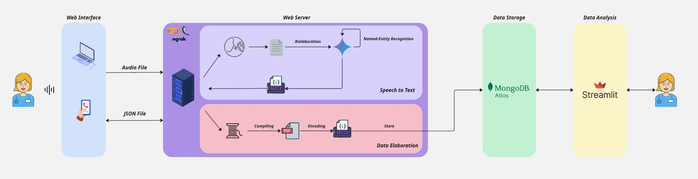
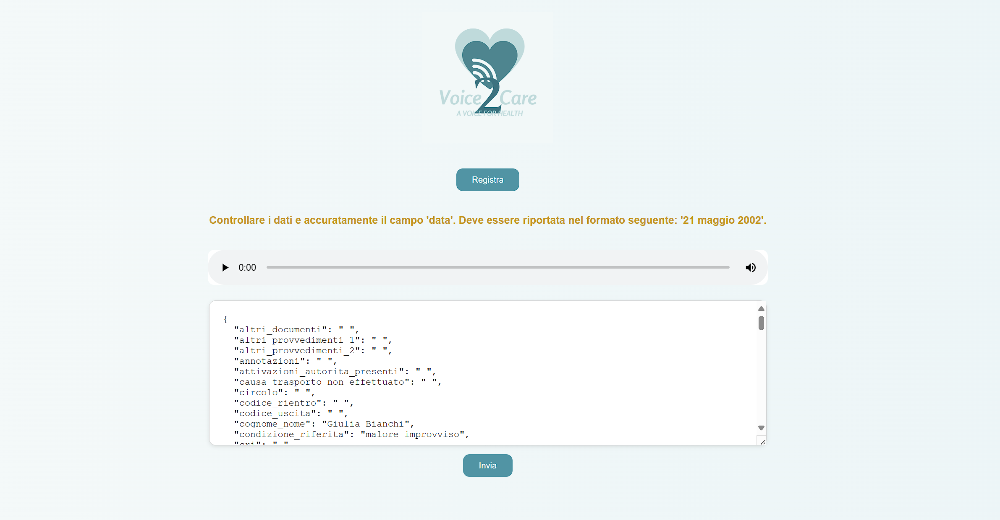

# Voice2Care - A voice for Health
  **Boccarossa Antonio M63001643** 
  
  **Brunello Francesco M63001655**


## ❓ Problema

Nel contesto sanitario, soprattutto nei reparti di emergenza, il personale medico è spesso costretto a trascrivere manualmente annotazioni cliniche in condizioni di stress e urgenza. Questo processo è:
- Lento e dispendioso in termini di tempo,
- Poco scalabile,
- Non ottimizzato per l’integrazione con i moderni sistemi informatici sanitari.

## 💡 Soluzione

_Voice2Care - A voice for health_ è un sistema integrato che automatizza il processo di documentazione clinica partendo da registrazioni vocali. Grazie a tecnologie di riconoscimento vocale, LLM (Large Language Model) e una dashboard interattivq, la piattaforma consente:
- La trascrizione automatica di note vocali.
- L’estrazione e strutturazione di informazioni cliniche rilevanti, al fine di compilare il report strutturato, in formato PDF.
- L’archiviazione rapida e scalabile tramite un database NoSQL Documentale.
- La visualizzazione di analitiche utili sui dati raccolti.

## 🧱 Architettura del Sistema


1. Voce del Medico catturata da interfaccia Web-Based
2. Server-Side
   1. **Speech-to-Text**
      1. Modello Speech-to-Text (**Whisper AI**)  
      2. LLM (**Gemini 2.0 Flash**)  
      3. Output strutturato in JSON  
      4. Modifica e conferma da parte del medico
   2. **Data Elaboration**
      1. Compilazione del PDF
      2. Decodifica e inserimento nel JSON finale
3. Database NoSQL per lo Storage (**MongoDB**)  
4. Dashboard interattiva (**Streamlit**)  

## ⏯️ Come Avviare il Progetto

1. Clona il repository:
   - `git clone https://github.com/frabru99/BigData.git`
   - `cd Progetto`
   -  **Caricare il Notebook su Colab e inserire le proprie API_KEY per Gemini, Ngrok e MongoDB Atlas**. 
   La struttura del Workspace dovrà essere la seguente:

      ```bash
      .
      └── Colab  Workspace/
         ├── static/
         │   ├── Voice2Care.png
         │   └── stle.css
         ├── templates/
         │   └── page.html
         └── report.pdf
      ```


2. Installa le dipendenze (per la Dashboard da eseguire in locale):
   - `pip install -r requirements.txt`

3. Avvia i componenti:
   1. Per il Notebook:
      - Apri il notebook, inserisci i tuoi secrets, avvialo e accedi alla pagina web esposta da ngrok.
   2. Per la Dashborad:
      - Creare il proprio file `.env` in cui inserie il `MONGO_USER` e la `MONGO_PASSWORD`,
      - Naviga fino alla cartella "Progetto" e avvia la dashboard con: `streamlit run /Dashboard/Dashboard/HomePage.py`.
  
### 🕸️ Web Page




## 🧪 Esempi d’Uso

- Chiamata al pronto soccorso: voce medico → trascrizione e generazione del documento.
- Briefing post intervento


## 📊 Tipologie di Dati Gestiti

- Audio registrato (**.mp3**)
- Testo trascritto
- JSON strutturati
- PDF

## 📈 Analitiche
- **Analitica 1**: **Questa sezione permette di recuperare le _informazioni utili in base all'anno e al mese specificato_. E' possibile consultare anche una :green[_Mappa delle Residenze_] in base al filtro specificato.**
- **Analitica 2**: **Questa sezione permette di recuperare informazioni per quanto riguarda la quantità di pazienti che hanno _contratto certe :red[lesioni]_ che è possibile specificare.**
- **Analitica 3**: **Questa sezione permette di valutare come evolte il :grey[tempo medio di servizio] (per anno) inteso come, _ora sul posto - ora chiamata_ in base alla città scelta**
- **Analitica 4**: **Questa sezoione permette di valutare quali sono i _:blue[provvedimenti] più utilizzati_ in base all'anno scelto.**
- **Analitica 5**: **Questa sezione permette di valutare quale è la :violet[Frequenza Cardiaca Media] presente nel DataBase in base al sesso specificato, con la possibilità di specificare l'anno e il mese di interesse.**

## 🛠️ Tecnologie Utilizzate

- Whisper AI - Speech-to-text  
- Gemini 2.0 Flash - LLM  
- MongoDB - Database NoSQL  
- Streamlit - Dashboard UI  
- pymupdf, pyPDF2 - Generazione PDF